# Student Data Analysis Project

This project explores a dataset of 45,000 student records using Python, Pandas, and Matplotlib.

📊 <b>Click to expand: Academic & Demographic Distributions</b>

| Age Distribution | Gender Distribution | Degree Percentages |
|:---:|:---:|:---:|
| 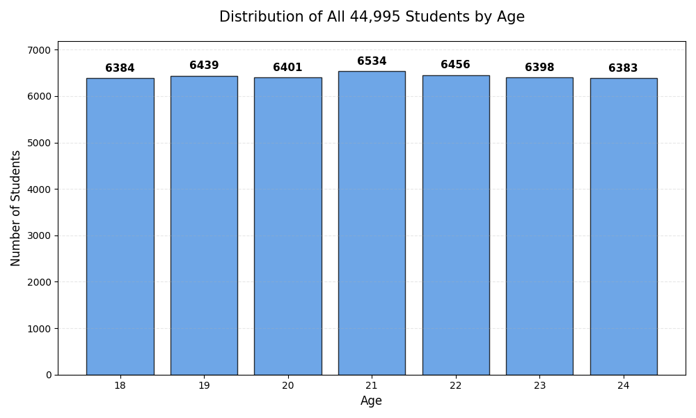 | 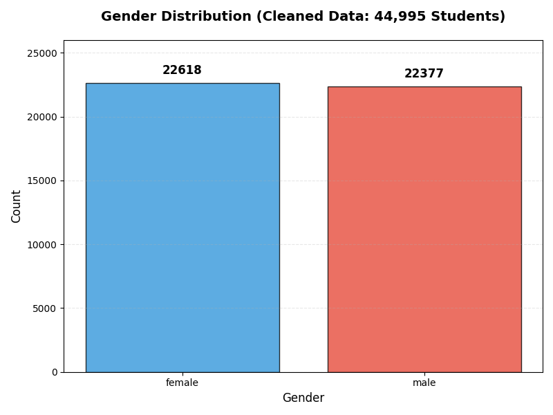 | 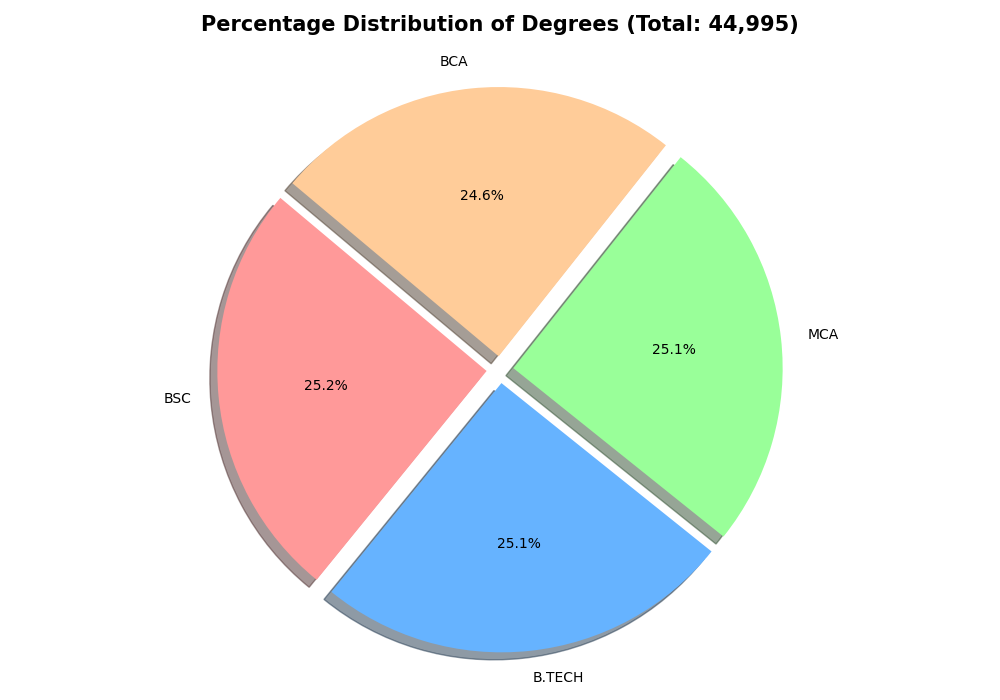 |

| Branch Distribution | CGPA Distribution | CGPA Heatmap |
|:---:|:---:|:---:|
| 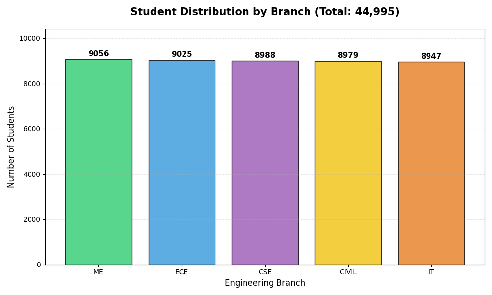 | 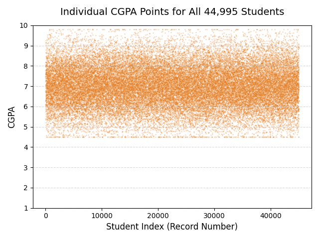 | 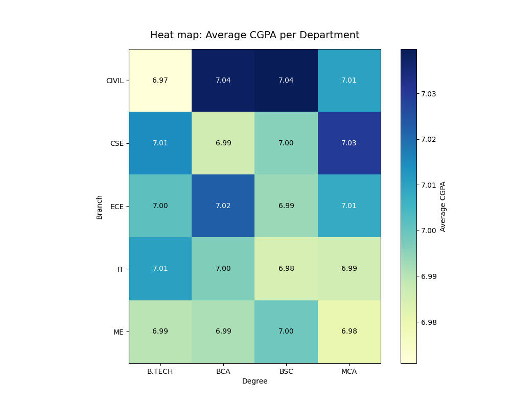 |

💼 <b>Click to expand: Career & Skills Analysis</b>

| Internships | Projects | Certifications |
|:---:|:---:|:---:|
| 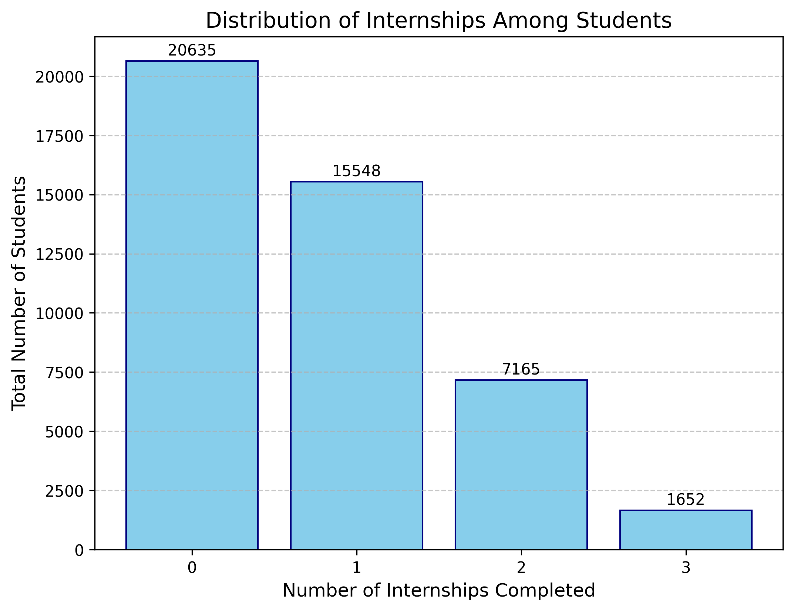 | 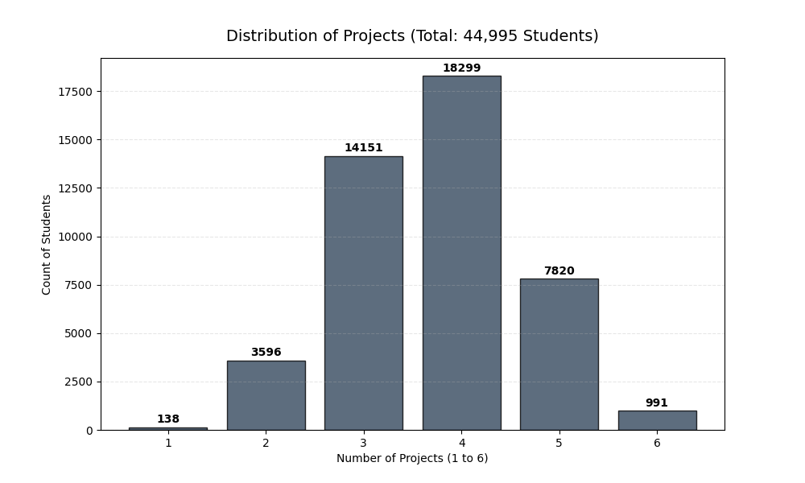 | 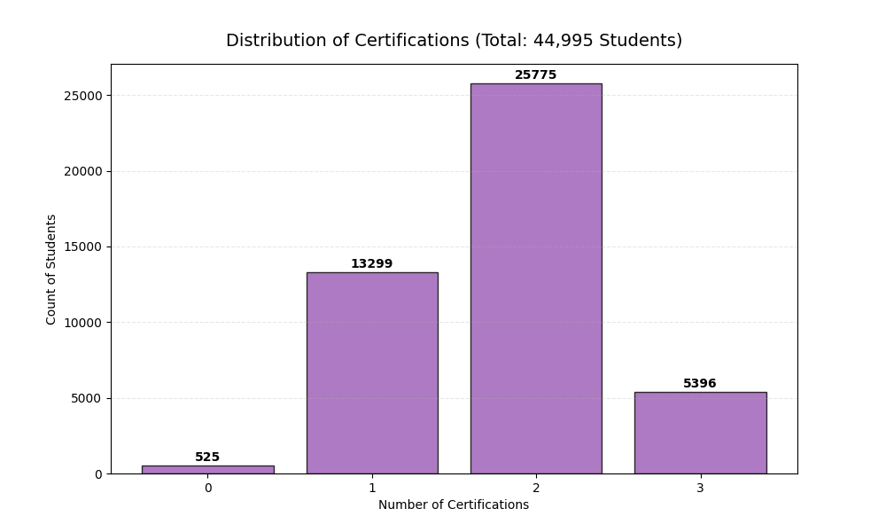 |

> **Combined Insights:**
> 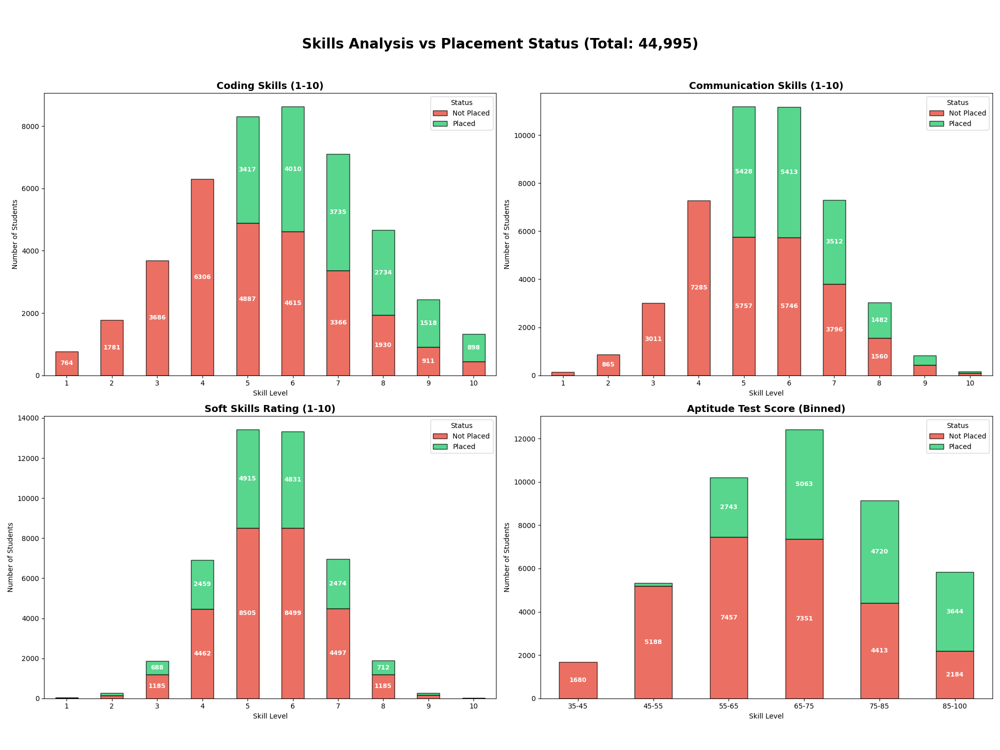

📈 <b>Click to expand: Placement Correlation Results</b>

| Internships vs Placement | Projects vs Placement |
|:---:|:---:|
| 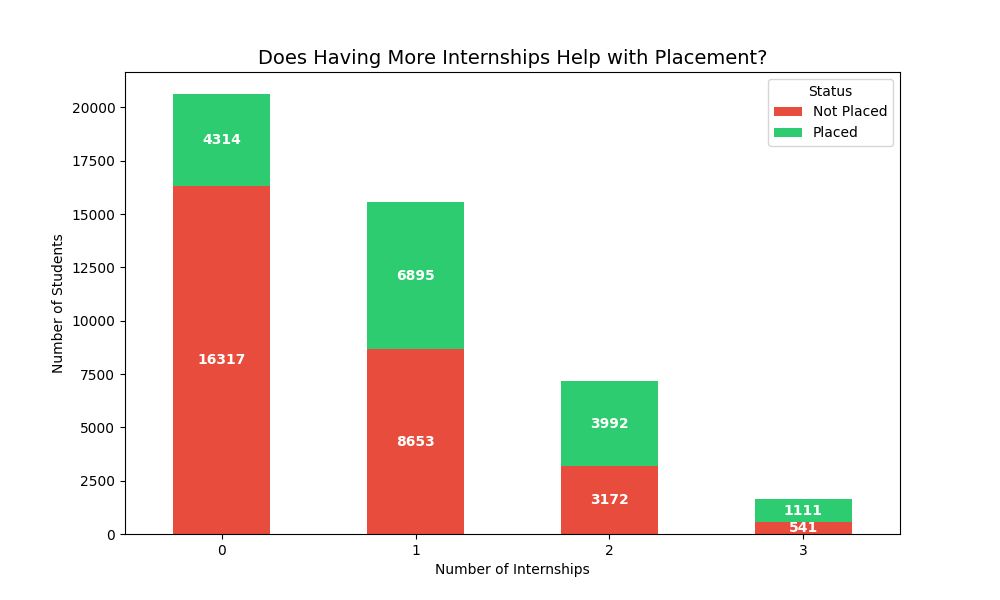 | 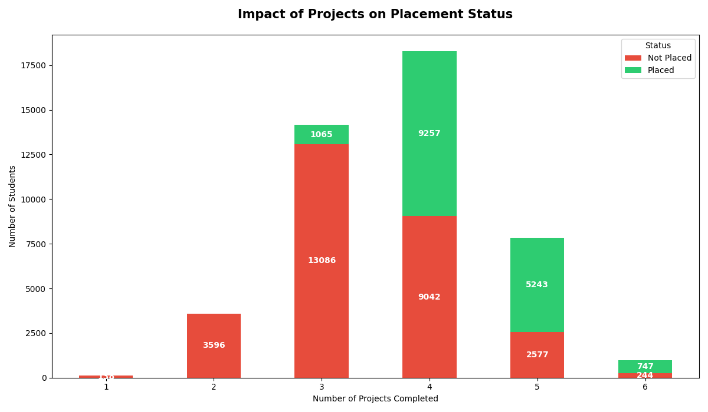 |

| Backlogs vs Placement | Certs vs Placement |
|:---:|:---:|
| 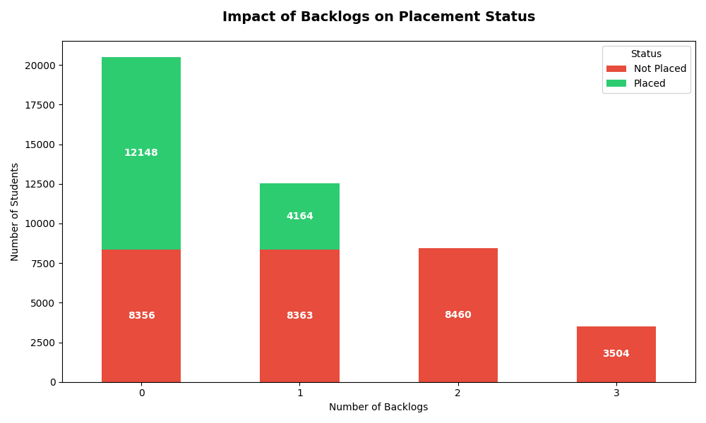 | 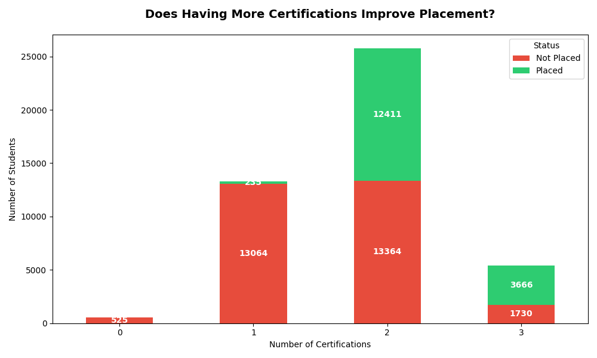 |

